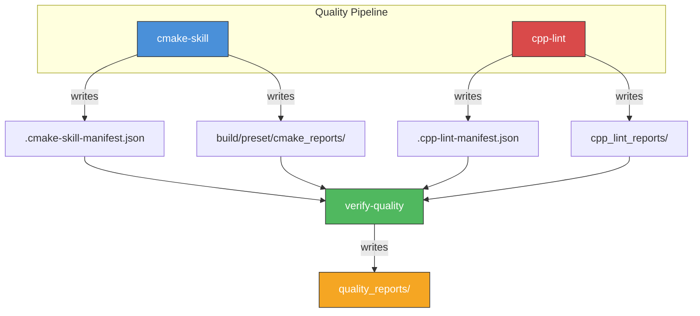

# cpp-lint 🤖 [AI Agent Skill]

**High-Performance C++ Analysis Pipeline for Autonomous AI Agents.**

`cpp-lint` provides low-latency static analysis and formatting. It minimizes noise by strictly filtering against the project's Git index and produces structured diagnostics for automated reasoning.

## 🌟 Key Features

- **Git-Native Filtering**: Surgical noise reduction by validating file paths against the repository index (O(1) set-based).
- **Parallel Analysis**: Concurrent execution of LLVM tools using thread pools for rapid feedback cycles.
- **Interoperable Reports**: Exports structured data in JSON and SARIF formats optimized for machine parsing.

## 🛠 Installation

Requires LLVM tools and `uv`.

```bash
git clone https://github.com/hiono/cpp-lint ~/.agents/skills/cpp-lint
```

## 📖 Usage

```bash
# Lint git-modified files (Explicit scope)
./scripts/cpp-lint changed

# Lint all tracked files
./scripts/cpp-lint all

# Apply safe fixes to modified files
./scripts/cpp-lint changed --fix
```

## 🤖 Reasoning Protocol

Refer to **[protocol.md](references/protocol.md)** for automated triage logic.

## 🔗 Orchestration



This skill **writes** reports to `cpp_lint_reports/` and `.cpp-lint-manifest.json`.
It does **not** depend on other skills, but other skills (verify-quality) read its output.

---
Maintained by **hiono**. Version **v0.3.2**.